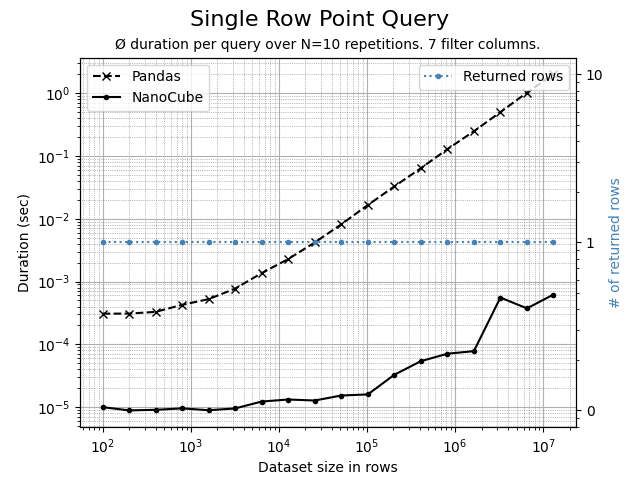
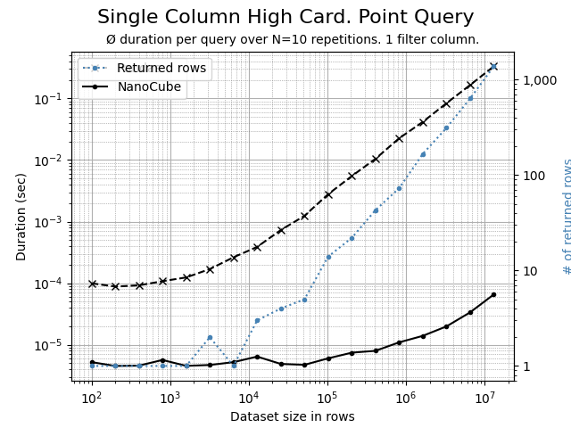
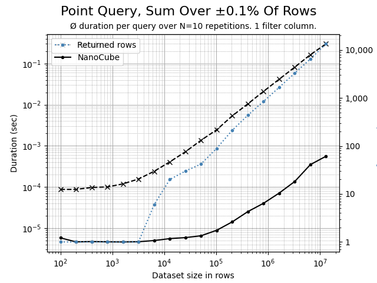
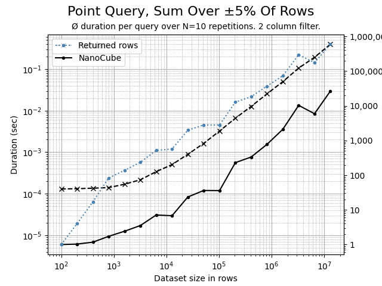
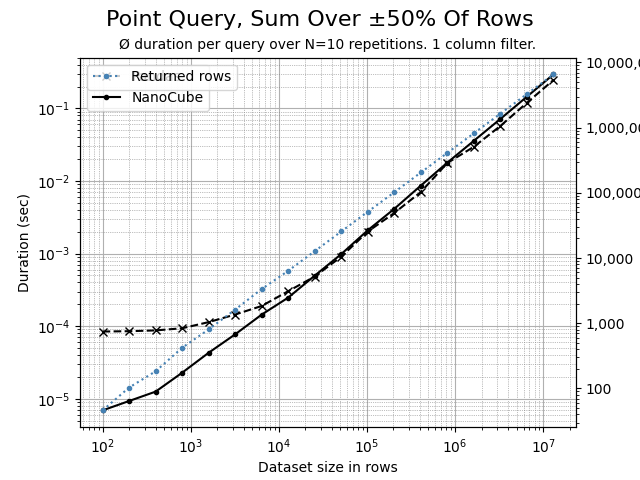
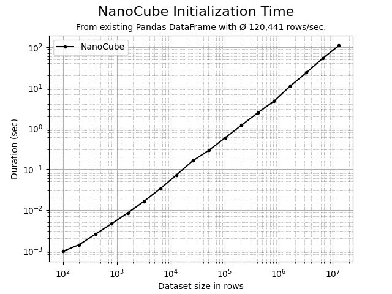

# NanoCube

## Lightning fast OLAP-style point queries on Pandas DataFrames.


-----------------

**NanoCube** is a super minimalistic, in-memory OLAP cube implementation for lightning fast point queries
upon Pandas DataFrames. It consists of only 27 lines of magical code that turns any DataFrame into a 
multi-dimensional OLAP cube. NanoCube shines when multiple point queries are needed on the same DataFrame,
e.g. for financial data analysis, business intelligence or fast web services.

``` bash
pip install nanocube
```

```python
import pandas as pd
from nanocube import NanoCube

# create a DataFrame
df = pd.read_csv('sale_data.csv')
value = df.loc[(df['make'].isin(['Audi', 'BMW']) & (df['engine'] == 'hybrid')]['revenue'].sum().item()

# create a NanoCube and run sum aggregated point queries
cube = NanoCube(df)
for i in range(1000):
    value = cube.get('revenue', make=['Audi', 'BMW'], engine='hybrid')
```

### Lightning fast - really?
For aggregated point queries NanoCube are up to 100x or evn 1,000x times faster than Pandas. For the special purpose,
NanoCube is also much faster than all other libraries, like Spark, Polars, Modin, Dask or Vaex. If such 
libraries are drop-in replacements with Pandas dataframe, you should be able to accelerate them with NanoCube too.

As a rule of thump, using NanoCube is valuable for 10 or more point queries on a DataFrame, as the 
initialization time for 50k - 200k rows/sec the NanoCube needs to be taken consideration. 


### How is this possible?
NanoCube uses a different approach. Roaring Bitmaps (https://roaringbitmap.org) are used to construct 
a multi-dimensional in-memory representation of a DataFrame. For each unique value in a column, a bitmap is created
that represents the rows in the DataFrame where this value occurs. The bitmaps are then combined to identify the 
rows relevant for a specific point query. Numpy is finally used for aggregation of results. 
NanoCube is a by-product of the CubedPandas project (https://github.com/Zeutschler/cubedpandas) and the result
of the attempt to make OLAP-style queries on Pandas DataFrames as fast as possible in a minimalistic way.

### What price do I need to pay?
First of all, NanoCube is free and MIT licensed. The first price you need to pay is the memory consumption, typically
up to 25% on top of the original DataFrame size. The second price is the time needed to initialize the cube, which is
mainly proportional to the number of unique values over all dimension columns in the DataFrame. Try and adapt the 
included sample [`sample.py`](sample.py) and benchmarks [`benchmark.py`](benchmark.py) and [`benchmark.ipynb`](benchmark.ipynb) 
to see the performance of the NanoCube approach.

### Bechmarks

Using the Python script [benchmark_ext.py](benchmark_ext.py), the following comparison charts can be created.
The data set contains 7 dimenion columns and 2 measure columns.

#### Point query for single row
A highly selective, but fully qualified query over all 7 dimensions that affects and aggregates 1 single row.
NanoCube is 100x or more times faster than Pandas. 



#### Point query on high cardinality column
A highly selective, filtering on a single high cardinality dimension, where each member
represents ±0.01% of rows. NanoCube is 100x or more times faster than Pandas. 




#### Point query aggregating 0.1% of rows
A highly selective, filtering just 1 dimension that affects and aggregates 0.1% of rows.
NanoCube is 100x or more times faster than Pandas. 



#### Point query aggregating 5% of rows
A barely selective, filtering 2 dimensions that affects and aggregates 5% of rows.
NanoCube is consistently 10x faster than Pandas. But you can already see, that the 
aggregation in Numpy become slightly more dominant. 



#### Point query aggregating 50% of rows
A non-selective, filtering 1 dimension that affects and aggregates 50% of rows.
Here, most of the time is spent in Numpy, aggregating the rows. The more
rows, the closer Pandas and NanoCube get as both rely on Numpy for
aggregation.



#### NanoCube initialization time
The time required to initialize a NanoCube instance is linear.
Depending on the number of dimensions and the cardinality a throughput of
20k to 200k rows/sec can be expected. Almost all time is spent requesting
data from Pandas. The initialization of the Roaring Bitmaps taken no time.
Likely, a custom file format for NanoCube data would be highly beneficial.




