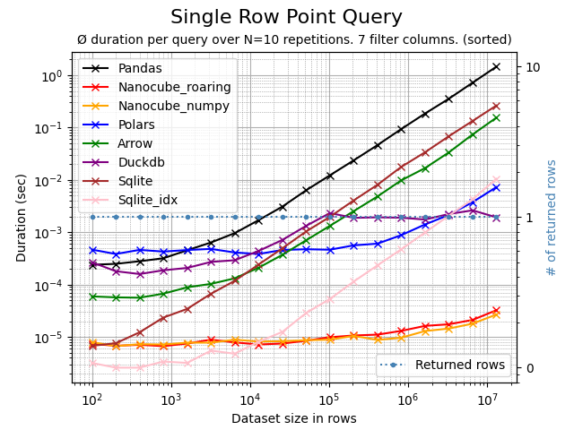
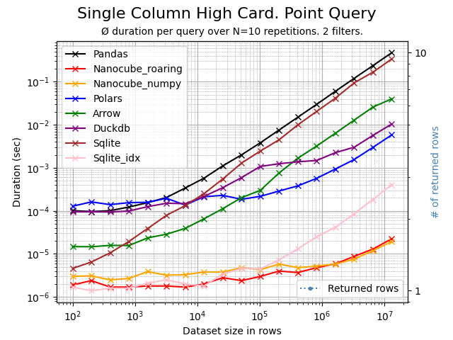
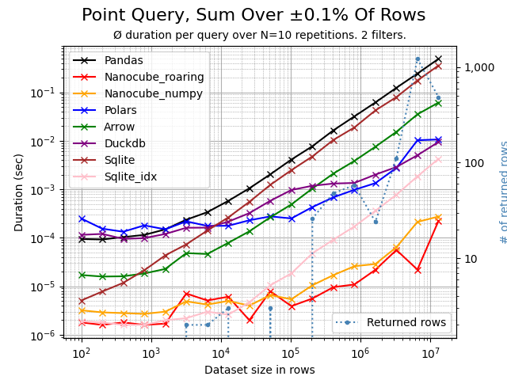
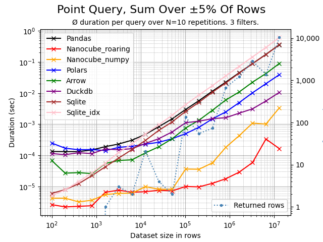
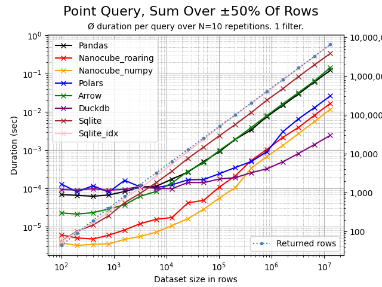

# NanoCube

## Lightning fast OLAP-style point queries on Pandas DataFrames.


-----------------

**NanoCube** is a minimalistic in-memory, in-process OLAP engine for lightning fast point queries
on Pandas DataFrames. As of now, less than 50 lines of code are required to transform a Pandas DataFrame into a 
multi-dimensional OLAP cube. NanoCube shines when point queries need to be executed on a DataFrame,
e.g. for financial data analysis, business intelligence or fast web services.

If you think it would be valuable to **extend NanoCube with additional OLAP features** 
please let me know. You can reach out by opening an issue or contacting me 
on [LinkedIn](https://www.linkedin.com/in/thomas-zeutschler/).

``` bash
pip install nanocube
```

```python
import pandas as pd
from nanocube import NanoCube

# create a DataFrame
df = pd.read_csv('sale_data.csv')
value = df.loc[(df['make'].isin(['Audi', 'BMW']) & (df['engine'] == 'hybrid')]['revenue'].sum()

# create a NanoCube and run sum aggregated point queries
# Declare the column supposed to be aggregated in `measures` and filtered in `dimensions`
nc = NanoCube(df, dimensions=["make", "engine"], measures=["revenue"])
for i in range(1000):
    value = nc.get('revenue', make=['Audi', 'BMW'], engine='hybrid')
```

> **Tip**: Only include those columns in the NanoCube setup, that you actually want to query!
> The more columns you include, the more memory and time is needed for initialization.
> ```
> df = pd.read_csv('dataframe_with_100_columns.csv')
> nc = NanoCube(df, dimensions=['col1', 'col2'], measures=['col100'])
> ``` 

> **Tip**: Use dimensions with highest cardinality first. This yields much faster response time 
> when more than 2 dimensions need to be filtered.
> ```
> nc.get(promo=True, discount=True, customer='4711')  # bad=slower, non-selevtive columns first
> nc.get(customer='4711', promo=True, discount=True)  # good=faster, most selective column first 
> ```

### Lightning fast - really?
For aggregated point queries NanoCube are up to 100x or even 1,000x times faster than Pandas. 
For this special purpose, NanoCube is even faster than other DataFrame oriented libraries, 
like Spark, Polars, Modin, Dask or Vaex. If such libraries are a drop-in replacements for Pandas,
then you should be able to accelerate them with NanoCube too. Try it and let me know.

NanoCube is beneficial only if multiple point queries (> 10) need to be executed, as the 
initialization time for the NanoCube needs to be taken into consideration.
The more point query you run, the more you benefit from NanoCube.

### How is this possible?
NanoCube creates an in-memory multi-dimensional index over all relevant entities/columns in a dataframe.
Internally, Roaring Bitmaps (https://roaringbitmap.org) are used for representing the index. 
Initialization may take some time, but yields very fast filtering and point queries.

Approach: For each unique value in all relevant dimension columns, a bitmap is created that represents the 
rows in the DataFrame where this value occurs. The bitmaps can then be combined or intersected to determine 
the rows relevant for a specific filter or point query. Once the relevant rows are determined, Numpy is used
then for to aggregate the requested measures. 

NanoCube is a by-product of the CubedPandas project (https://github.com/Zeutschler/cubedpandas) and will be integrated
into CubedPandas in the future. But for now, NanoCube is a standalone library that can be used with 
any Pandas DataFrame for the special purpose of point queries.

### What price do I have to pay?
NanoCube is free and MIT licensed. The prices to pay are additional memory consumption, depending on the
use case typically 25% on top of the original DataFrame and the time needed for initializing the 
multi-dimensional index, typically 250k rows/sec depending on the number of columns to be indexed and 
your hardware. The initialization time is proportional to the number of rows in the DataFrame (see below).

You may want to try and adapt the included samples [`sample.py`](samples/sample.py) and benchmarks 
[`benchmark.py`](benchmarks/benchmark.py) and [`benchmark.ipynb`](benchmarks/benchmark.ipynb) to test the behavior of NanoCube 
on your data.

## NanoCube Benchmarks

Using the Python script [benchmark.py](benchmarks/benchmark.py), the following comparison charts can be created.
The data set contains 7 dimension columns and 2 measure columns.

#### Point query for single row
A highly selective query, fully qualified and filtering on all 7 dimensions. The query will return and aggregates 1 single row.
NanoCube is 100x or more times faster than Pandas. 


If sorting is applied to the DataFrame - low cardinality dimension columns first, higher dimension cardinality 
columns last - then the performance of NanoCube can (not must) improve by up to factor ±10x. Here, the same query
as above, but the DataFrame is sorted accordingly.



#### Point query on high cardinality column
A highly selective, filtering on a single high cardinality dimension, where each member
represents ±0.01% of rows. NanoCube is 100x or more times faster than Pandas. 




#### Point query aggregating 0.1% of rows
A highly selective, filtering on 1 dimension that affects and aggregates 0.1% of rows.
NanoCube is 100x or more times faster than Pandas. 



#### Point query aggregating 5% of rows
A barely selective, filtering on 2 dimensions that affects and aggregates 5% of rows.
NanoCube is consistently 10x faster than Pandas. But you can already see, that the 
aggregation in Numpy become slightly more dominant. 



#### Point query aggregating 50% of rows
A non-selective query, filtering on 1 dimension that affects and aggregates 50% of rows.
Here, most of the time is spent in Numpy, aggregating the rows. The more
rows, the closer Pandas and NanoCube get as both rely on Numpy for
aggregation.



#### NanoCube initialization time
The time required to initialize a NanoCube instance is almost linear.
The initialization throughput heavily depends on the number of dimension columns. 
A custom file format will be added soon allowing ±4x times faster loading
of a NanoCube in comparison to loading the respective parquet dataframe file
using Arrow.


