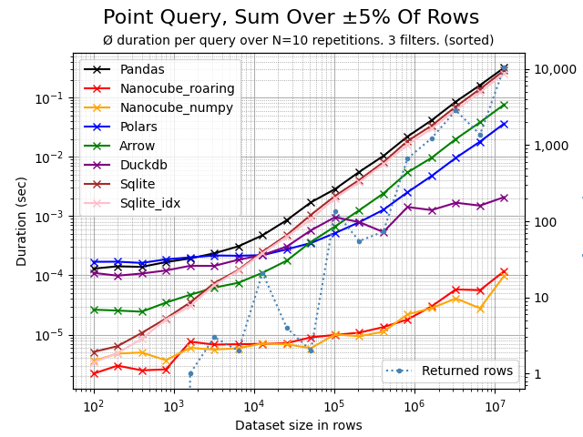
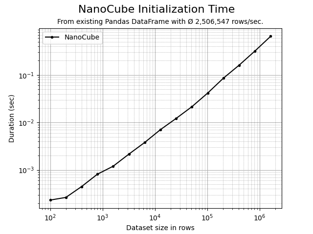

# NanoCube

## Lightning fast OLAP-style point queries on DataFrames.


-----------------

**NanoCube** is a minimalistic in-memory, in-process OLAP engine for lightning fast point queries
on Pandas DataFrames. NanoCube shines when filtering and/or point queries need to be executed on a DataFrame,
e.g. for financial data analysis, business intelligence or fast web services.

If you think it would be valuable to **extend NanoCube with additional OLAP features** 
please let me know. You can reach out by opening an issue or contacting me 
on [LinkedIn](https://www.linkedin.com/in/thomas-zeutschler/).

``` bash
pip install nanocube
```

```python
import pandas as pd
from nanocube import NanoCube

# create a DataFrame
df = pd.read_csv('sale_data.csv')
value = df.loc[(df['make'].isin(['Audi', 'BMW']) & (df['engine'] == 'hybrid')]['revenue'].sum()

# create a NanoCube and run sum aggregated point queries
nc = NanoCube(df)
for i in range(1000):
    value = nc.get('revenue', make=['Audi', 'BMW'], engine='hybrid')
```

### Lightning fast - really?
Aggregated point queries with NanoCube are often 100x to 1,000x times faster than using Pandas.
The more selective the query, the more you benefit from NanoCube. For highly selective queries,
NanoCube can even be 10,000x times faster than Pandas. For non-selective queries, the performance
is 10x faster and finally similar to Pandas, as both rely on Numpy for aggregation. NanoCube
only accelerates the filtering of data, not the aggregation.


For the special purpose of aggregative point queries, NanoCube is even faster than other 
DataFrame related technologies, like Spark, Polars, Modin, Dask or Vaex. If such libraries are 
a drop-in replacements for Pandas, then you should be able to speed up their filtering quite noticeably. 
Try it and let me know how it performs.

NanoCube is beneficial only if some point queries (> 5) need to be executed, as the 
initialization time for the NanoCube needs to be taken into consideration.
The more point query you run, the more you benefit from NanoCube.

### Benchmark - NanoCube vs. Others
The following table shows the duration for a single point query on the
`car_prices_us` dataset (available on [kaggle.com](https://www.kaggle.com)) containing 16x columns and 558,837x rows. 
The query is highly selective, filtering on 4 dimensions `(model='Optima', trim='LX', make='Kia', body='Sedan')` and 
aggregating column `mmr`. The factor is the speedup of NanoCube vs. the respective technology.

To reproduce the benchmark, you can execute file [nano_vs_others.py](benchmarks/nano_vs_others.py).

|    | technology       |   duration_sec |   factor |
|---:|:-----------------|---------------:|---------:|
|  0 | NanoCube         |          0.021 |    1     |
|  1 | SQLite (indexed) |          0.196 |    9.333 |
|  2 | Polars           |          0.844 |   40.19  |
|  3 | DuckDB           |          5.315 |  253.095 |
|  4 | SQLite           |         17.54  |  835.238 |
|  5 | Pandas           |         51.931 | 2472.91  |


### How is this possible?
NanoCube creates an in-memory multi-dimensional index over all relevant entities/columns in a dataframe.
Internally, Roaring Bitmaps (https://roaringbitmap.org) are used by default for representing the index. 
Initialization may take some time, but yields very fast filtering and point queries. As an alternative
to Roaring Bitmaps, Numpy-based indexing can be used. These are faster if only one filter is applied,
but can be orders of magnitude slower if multiple filters are applied.

Approach: For each unique value in all relevant dimension columns, a bitmap is created that represents the 
rows in the DataFrame where this value occurs. The bitmaps can then be combined or intersected to determine 
the rows relevant for a specific filter or point query. Once the relevant rows are determined, Numpy is used
then for to aggregate the requested measures. 

NanoCube is a by-product of the CubedPandas project (https://github.com/Zeutschler/cubedpandas) and will be integrated
into CubedPandas in the future. But for now, NanoCube is a standalone library that can be used with 
any Pandas DataFrame for the special purpose of point queries.

### Tips for using NanoCube
> **Tip**: Only include those columns in the NanoCube setup, that you actually want to query!
> The more columns you include, the more memory and time is needed for initialization.
> ```
> df = pd.read_csv('dataframe_with_100_columns.csv')
> nc = NanoCube(df, dimensions=['col1', 'col2'], measures=['col100'])
> ```

> **Tip**: If you have a DataFrame with more than 1 million rows, you may want to sort the DataFrame
> before creating the NanoCube. This can improve the performance of NanoCube significantly, upto 10x times.

> **Tip**: NanoCubes can be saved and loaded to/from disk. This can be useful if you want to reuse a NanoCube
> for multiple queries or if you want to share a NanoCube with others. NanoCubes are saved in Arrow format but
> load up to 4x times faster than the respective parquet DataFrame file.
> ```
> nc = NanoCube(df, dimensions=['col1', 'col2'], measures=['col100'])
> nc.save('nanocube.nc')
> nc_reloaded = NanoCube.load('nanocube.nc')
> > ```


### What price do I have to pay?
NanoCube is free and MIT licensed. The prices to pay are additional memory consumption, depending on the
use case typically 25% on top of the original DataFrame and the time needed for initializing the 
multi-dimensional index, typically 250k rows/sec depending on the number of columns to be indexed and 
your hardware. The initialization time is proportional to the number of rows in the DataFrame (see below).

You may want to try and adapt the included samples [`sample.py`](samples/sample.py) and benchmarks 
[`benchmark.py`](benchmarks/benchmark.py) and [`benchmark.ipynb`](benchmarks/benchmark.ipynb) to test the behavior of NanoCube 
on your data.

## NanoCube Benchmarks

Using the Python script [benchmark.py](benchmarks/benchmark.py), the following comparison charts can be created.
The data set contains 7 dimension columns and 2 measure columns.

#### Point query for a single row
A highly selective query, fully qualified and filtering on all 7 dimensions. The query will return and aggregates 1 single row.
NanoCube is 250x up to 60,000x more times faster than Pandas, depending on the number of size in the DataFrame,
the more rows, the faster NanoCube is in comparison to Pandas.


#### Point query on high cardinality column
A highly selective, filtering on a single high cardinality dimension, where each member
represents ±0.01% of rows. NanoCube is 100x or more times faster than Pandas. 


#### Point query aggregating 0.1% of rows
A highly selective, filtering on 1 dimension that affects and aggregates 0.1% of rows.
NanoCube is 100x or more times faster than Pandas. 


#### Point query aggregating 5% of rows
A barely selective, filtering on 2 dimensions that affects and aggregates 5% of rows.
NanoCube is consistently 10x faster than Pandas. But you can already see, that the 
aggregation in Numpy become more dominant -> compare the lines of the number of returned 
records and the NanoCube response time, they are almost parallel. 


If sorting is applied to the DataFrame - low cardinality dimension columns first, higher dimension cardinality 
columns last - then the performance of NanoCube can potentially improve dramatically, ranging from not faster
up to ±10x or more times faster. Here, the same query as above, but the DataFrame was sorted beforehand.




#### Point query aggregating 50% of rows
A non-selective query, filtering on 1 dimension that affects and aggregates 50% of rows.
Here, most of the time is spent in Numpy, aggregating the rows. The more
rows, the closer Pandas and NanoCube get as both rely finally on Numpy for
aggregation, which is very fast.


#### NanoCube initialization time
The time required to initialize a NanoCube instance is almost linear.
The initialization throughput heavily depends on the number of dimension columns. 
A custom file format will be added soon allowing ±4x times faster loading
of a NanoCube in comparison to loading the respective parquet dataframe file
using Arrow.




