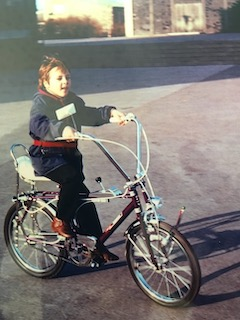

{ align=left }

My name is Thomas Zeutschler. I'm located in Germany in the ['Ruhrgebiet' area](https://en.wikipedia.org/wiki/Ruhr)
and love to code in Python due to Python's awesome and endless library ecosystem, great support community
and easy extensibility through tools like Numba, Cython or with languages like C, C++ and Rust.

Pandas is a tool to which I have a strong love/hate relationship. It's a great tool, but sometimes it's
annoyingly complex and tedious to use, that's why I started the CubedPandas project.

I'm a professional software architect and developer with focus on data, analytics, AI and modern
cloud based data architectures and data processing as well as the development, optimization,
modernization and especially speed-up of data-focussed solutions and systems of every size and complexity.

In addition, I enjoy to be a senior analytics and fellow at the
[BARC - Business Analytics Research Center](https://barc.com) in Würzburg, Germany. BARC is the largest independent
market analyst for data, analytics & AI, business intelligence and corporate performance management in the
D-A-CH region. I proudly support mid-sized and large companies in improving their data & analytics capabilities, setup,
and strategy. And I am honoured to help some well-known software vendors support their products and go-to-market
strategies market strategies in the area of data & analytics.

I'm a big fan and intense user of open source software. CubedPandas is one of my projects to say thank you to the
community and give something back. I hope you enjoy using CubedPandas as much as I enjoy developing it.

Hobbies? Anything on two wheels, with or without an engine, on-road or off-road is my passion.

If you would like to get in contact, do not hesitate to reach out to me
on [LinkedIn](https://www.linkedin.com/in/thomaszeutschler/) or [reddit](https://www.reddit.com/r/cubedpandas/) or
[GitHub](https://github.com/Zeutschler).

*Yours Thomas*
